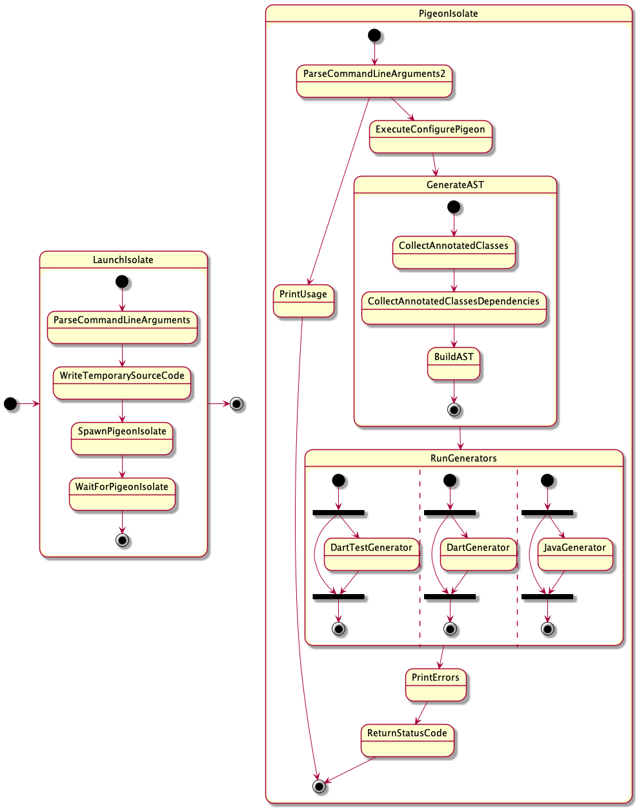

# Pigeon Contributor's Guide

## Description

Pigeon is a code generation tool that adds type safety to Flutter’s Platform
Channels.  This document serves as an overview of how it functions to help
people who would like to contribute to the project.

## State Diagram

Pigeon generates a temporary file in its _LaunchIsolate_, the isolate that is
spawned to run `main()`, then launches another isolate, _PigeonIsolate_, that
uses `dart:mirrors` to parse the generated file, creating an
[AST](https://en.wikipedia.org/wiki/Abstract_syntax_tree), then running code
generators with that AST.



## Source Index

* [ast.dart](./lib/ast.dart) - The data structure for representing the Abstract Syntax Tree.
* [dart_generator.dart](./lib/dart_generator.dart) - The Dart code generator.
* [java_generator.dart](./lib/java_generator.dart) - The Java code generator.
* [objc_generator.dart](./lib/objc_generator.dart) - The Objective-C code
  generator (header and source files).
* [cpp_generator.dart](./lib/cpp_generator.dart) - The C++ code generator.
* [generator_tools.dart](./lib/generator_tools.dart) - Shared code between generators.
* [pigeon_cl.dart](./lib/pigeon_cl.dart) - The top-level function executed by
  the command line tool in [bin/][./bin].
* [pigeon_lib.dart](./lib/pigeon_lib.dart) - The top-level function for the
  PigeonIsolate and the AST generation code.
* [pigeon.dart](./lib/pigeon.dart) - A file of exported modules, the intended
  import for users of Pigeon.

## Testing Overview

Pigeon has 3 types of tests, you'll find them all in [run_tests.sh](./run_tests.sh).

* Unit tests - These are the fastest tests that are just typical unit tests,
  they may be generating code and checking it against a regular expression to
  see if it's correct.  Example:
  [dart_generator_test.dart](./test/dart_generator_test.dart)
* Compilation tests -  These tests generate code, then attempt to compile that
  code.  These are tests are much slower than unit tests, but not as slow as
  integration tests.  These tests are typically run against the Pigeon files in
  [pigeons](./pigeons).
* Integration tests - These tests generate code, then compile the generated
  code, then execute the generated code.  It can be thought of as unit-tests run
  against the generated code.  Examples: [platform_tests](./platform_tests)

## Generated Source Code Example

This is what the temporary generated code that the _PigeonIsolate_ executes
looks like (see [State Diagram](#state-diagram)):

```dart
@dart = 2.12
import 'path/to/supplied/pigeon/file.dart'
import 'dart:io';
import 'dart:isolate';
import 'package:pigeon/pigeon_lib.dart';
void main(List<String> args, SendPort sendPort) async {
  sendPort.send(await Pigeon.run(args));
}
```

This is how `dart:mirrors` gets access to the supplied Pigeon file.

## Imminent Plans

* Migrate to Dart Analyzer for AST generation ([issue
  78818](https://github.com/flutter/flutter/issues/78818)) - We might have
  reached the limitations of using dart:mirrors for parsing the Dart files.
  That package has been deprecated and it doesn't support null-safe annotations.
  We should migrate to using the Dart Analyzer as the front-end parser.
